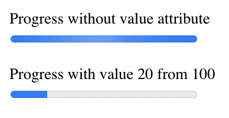

# HTML `<progress>` Element

Progress tag can be used to represent progress of a task.

Attributes:

- `max` - Indicates how much task needs to be done before it can be considered as complete. If not specified the default value is 1.0.
- `value` - Indicates the current status of the progress bar. It must be greater than or equal to 0.0 and less than or equal to 1.0 or the value of the max attribute (if present).

Example:

```
<progress value="20" max="100"></progress>
```


