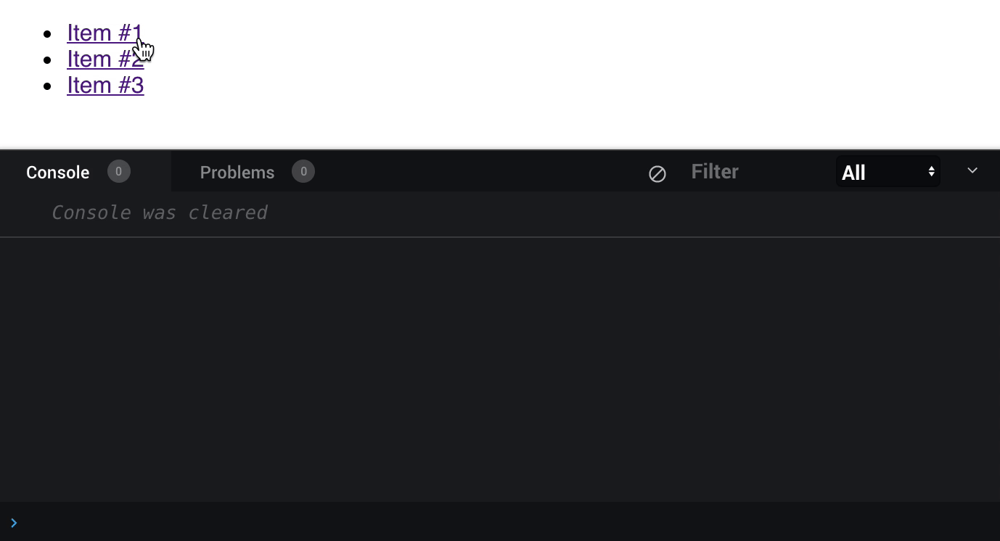

# event.target vs event.currentTarget

`event.currentTarget` - refers to the element that event listener is attached.

`event.target` - refers to the specific element you interact with.

Example:

```html
<ul>
  <li>
    <a href="#">Item #1</a>
  </li>
  <li>
    <a href="#">Item #2</a>
  </li>
  <li>
    <a href="#">Item #3</a>
  </li>
</ul>
```

```javascript
const list = document.querySelector('ul');
list.addEventListener('click', event => {
  console.group('target vs currentTarget');
  console.log('currentTarget: ', event.currentTarget);
  console.log('target: ', event.target);
  console.groupEnd();
});
```

Real Demo:

As we can see `currentTarget` refers to the `ul` element no matter where we click.
